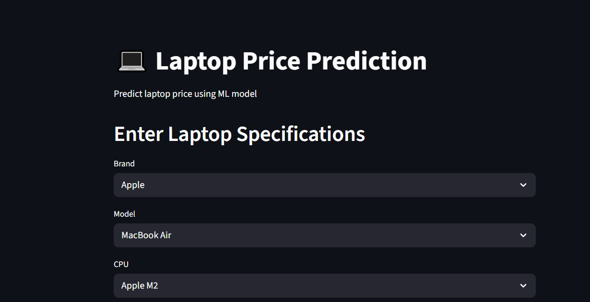
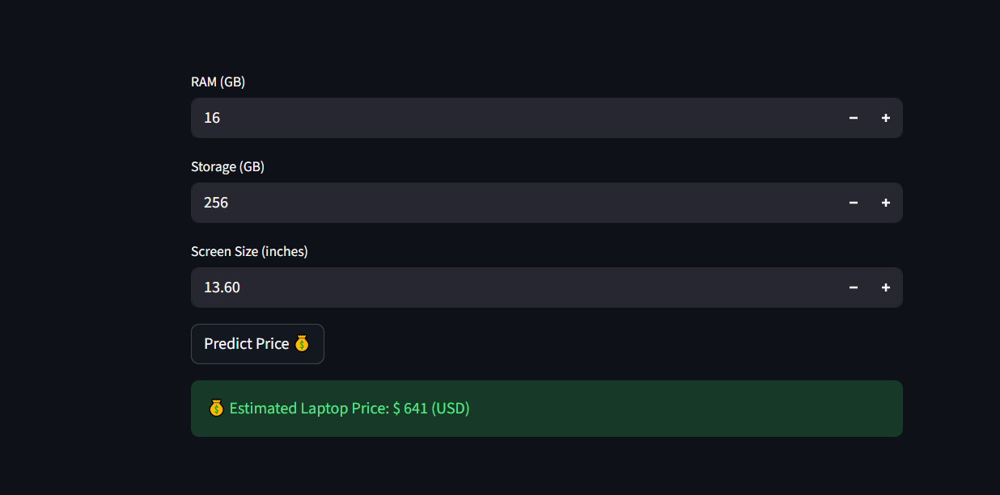

# 💻 Laptop Price Prediction


A **Machine Learning project** that predicts laptop prices based on specifications such as **brand, RAM, storage, processor, GPU, and other hardware features**.

---

## 📌 Project Overview

This project builds a **regression model** that estimates laptop prices based on their hardware specifications.
The project includes **data analysis, preprocessing, model training, evaluation, and deployment using a web interface and API**.

---

## 🚀 Features

* Built a **machine learning regression model** to predict laptop prices from laptop specifications.
* Performed **Exploratory Data Analysis (EDA)** to understand price patterns and feature relationships.
* Applied **data preprocessing techniques** such as:

  * Missing value handling
  * Outlier treatment
  * Feature encoding
  * Feature scaling
* Trained multiple models including:

  * Linear Regression
  * Random Forest
  * Gradient Boosting
* Selected the best model using **R² Score, MAE, and RMSE evaluation metrics**.
* Developed an **interactive Streamlit web application** for easy price prediction.
* Built a **FastAPI REST API** to serve the trained model for backend inference.

---

## 🛠️ Tech Stack

* Python
* Pandas
* NumPy
* Scikit-learn
* Matplotlib
* Seaborn
* Streamlit
* FastAPI

---

## 📊 Model Evaluation

The models were evaluated using the following metrics:

* **R² Score**
* **Mean Absolute Error (MAE)**
* **Root Mean Squared Error (RMSE)**

The **best-performing model** was selected based on these metrics.

---

## 📂 Project Structure

```
Laptop-Price-Prediction
│
├── data
│   └── laptop_data.csv
│
├── notebooks
│   └── EDA_and_model_training.ipynb
│
├── models
│   └── trained_model.pkl
│
├── app
│   ├── streamlit_app.py
│   └── api.py
│
├── requirements.txt
└── README.md
```

---

## 🖥️ Streamlit Web Application

The project includes a **Streamlit-based web interface** where users can input laptop specifications and get a predicted price instantly.

(Add your Streamlit app screenshot here)






---

## 🔗 FastAPI Model API

The trained model is exposed through a **FastAPI REST API**, allowing the model to be used in other applications.

Example endpoint:

```
POST /predict
```

---

## 📌 Use Case

Users enter laptop specifications such as **brand, RAM, storage, processor, and GPU**, and the system predicts the **estimated laptop price** using the trained machine learning model.

---

## 📈 Future Improvements

* Deploy the application on **Cloud (AWS / GCP / Render / Hugging Face Spaces)**
* Add **more laptop features** for better prediction
* Improve model performance with **advanced ML algorithms**

---

⭐ If you like this project, feel free to **star the repository**!
